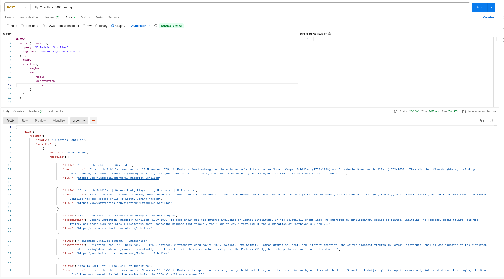

# Roxy
Is a small metasearch engine microservice written in Rust.  
The goal of this project is customizability and resource savings trough GraphQL usage.  
Possible use-cases include:
- Backend for LLM Agents / Discord Bots
- Backend for IOT products
- Backend for Search App in low bandwidth environments (Countryside, Desert, Deutsche Bahn...)

